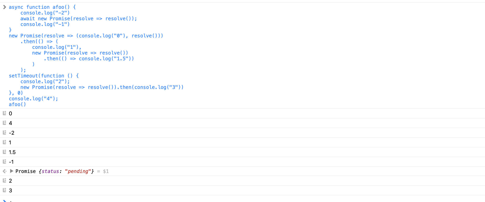

# 每周总结可以写在这里

[Realm Object可视化](https://codesandbox.io/s/little-lake-31s9r?file=/index.html)

>宏任务

        宏任务包含： script、setTimeout、setInterval、setImmediate、I/O、UI rendering
        1、脚本，渲染事件（如解析DOM，计算布局，布局）
        2、mousemove等UI事件，用户互动事件（如鼠标点击，滚动页面，放大缩小等）
        3、setTimeout / setInterval当JS引擎忙于执行宏任务时，宏任务就会形成一个
        副本，直到上一个宏任务执行完成，才会继续执行宏任务标题中的任务。例如，当
        JS、引擎忙于执行外部脚本脚本时，此时界面触发了鼠标移动事件，然后又触发了计
        时器，这时候，鼠标移动事件和计时器会形成宏任务变量，等待执行。
        4、JavaScript脚本执行事件；网络请求完成，文件读写完成事件。为了协调这些任务有条不扭曲地在主线程上执行，页面进程重新启动消息事件和事件循环机制，渲染内部会维护多个消息变量，而不连续进行。然后将主线程采用一个进行循环，不断地从这些任务中取任务并执行任务。我们把这些消息本身的任务称为宏任务。

>微任务

        微任务包含有：process.nextTick、promise、Object.observe、MutationObserver
        微任务就是一个需要异步执行的函数，执行时机是在主函数执行结束之后，当前宏任
        务结束之前。
        1、微任务和宏任务是绑定的，每个宏任务在执行时，会创建自己的微任务副本
        2、一些一个宏任务在执行过程中，产生了100个微任务，执行每个微任务的时间是10
           毫秒，那么执行这100个微任务的时间。就是1000毫秒，也可以说这100个微任务
           让宏任务的执行时间延长了1000毫秒。所以你在写代码的时候一定要注意控制微
           任务的执行时长。
        3、在一个宏任务中，分别创建一个用于替代的宏任务和微任务，无论什么情况下，
           微任务都早于宏任务执行

```js
async function afoo() {
    console.log("-2")
    await afoo2()
    console.log("-1")
}
async function afoo2(){

}
new Promise(resolve=>{
    console.log("0");
    resolve()
}).then(()=>{
    console.log("1")
    new Promise(resolve => resolve())
        .then(() => console.log("1.5"))
    }
)
setTimeout(function () {
    console.log("2");
    new Promise(resolve => resolve()).then(console.log("3"))
}, 0)
console.log("4");
afoo()
// 运行结果1： chrome
// 宏任务
// 0  4  -2 (异步开始入队 promise优先await  所以输出1 -1)
// 1 （异步再次入队，1.5后于-1输出
// -1
// 1.5
// 宏任务
// 2
// 3
// 运行结果2： sarfir
// 0 4 -2 1 1.5 -1 2 3
// 例题
```
Chrome运行结果

Safari运行结果


```js
async function afoo() {
    console.log("-2")
    await new Promise(resolve => resolve());
    console.log("-1")
}
new Promise(resolve => (console.log("0"), resolve()))
    .then(() => (
        console.log("1"),
        new Promise(resolve => resolve())
            .then(() => console.log("1.5"))
        )
    );
setTimeout(function () {
    console.log("2");
    new Promise(resolve => resolve()).then(console.log("3"))
}, 0)
console.log("4");
afoo()
```
Chrome运行结果

Safari运行结果


