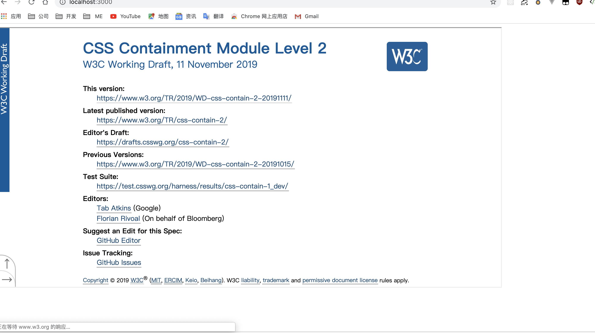

# 每周总结可以写在这里

## 利用 node 爬虫爬取 CSS 标准

```js
const Koa = require("koa");
const superagent = require("superagent");
const cheerio = require("cheerio");
const views = require("koa-views");
const path = require("path");

const app = new Koa();
const URL = "https://www.w3.org/TR/?tag=css";
const dataList = [];

const transferData = (html) => {
  console.log("==========开始处理数据============");
  const $ = cheerio.load(html.text);
  $("ul#container li").each((idx, ele) => {
    // cherrio中$('selector').each()用来遍历所有匹配到的DOM元素
    // 参数idx是当前遍历的元素的索引，ele就是当前便利的DOM元素
    let dataTag = $(ele).attr("data-tag");
    if (dataTag && dataTag.match(/css/)) {
      dataList.push({
        name: $($(ele).children()[1]).text(), // 标题
        url: $($($(ele).children()[1]).children()[0]).attr("href"), // 链接
      });
    }
  });
  console.log("==========结束处理数据============");
};

const fetchHtml = () => {
  console.log("==========开始抓取页面============");
  superagent.get(URL).end((error, res) => {
    if (!error) {
      console.log("==========抓取页面结束============");
      transferData(res);
    }
  });
};

app.use(
  views(path.join(__dirname, "./view"), {
    extension: "ejs",
  })
);

app.use(async (ctx) => {
  await ctx.render("index", {
    dataList,
  });
});

app.listen(3000, () => {
  console.log("服务器启动在3000端口");
  fetchHtml();
});
```

## 动态拉取相关标准网页

```js
var dataList = JSON.parse("<%-JSON.stringify(dataList)%>");
let iframe = document.createElement("iframe");
iframe.width = "70%";
iframe.height = "600px";
document.body.innerHTML = "";
document.body.appendChild(iframe);

const happen = (element, event) => {
  return new Promise((resolve) => {
    let handler = () => {
      resolve();
      element.removeEventListener(event, handler);
    };
    element.addEventListener(event, handler);
  });
};

void (async function () {
  for (let item of dataList) {
    iframe.src = item.url;
    await happen(iframe, "load");
  }
})();
```



